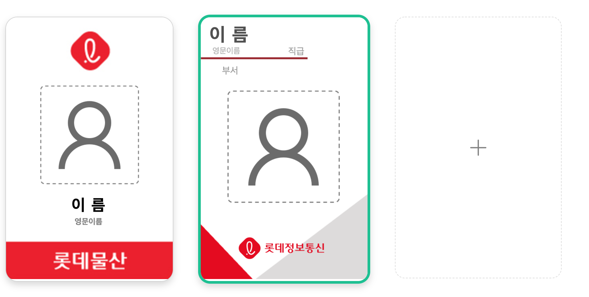
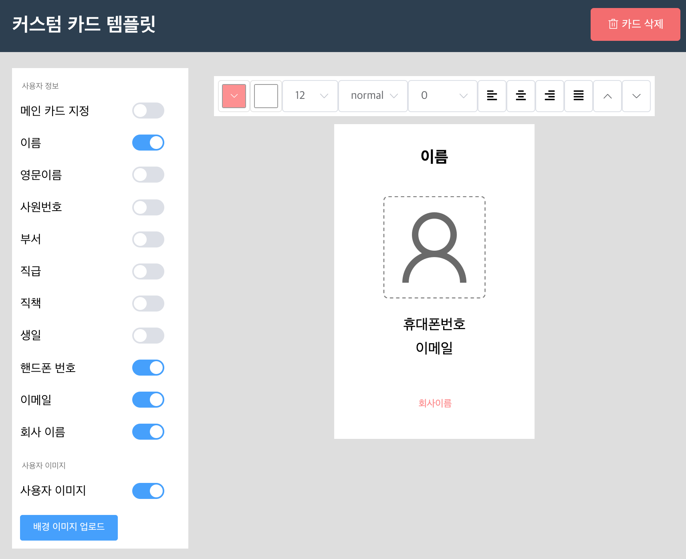
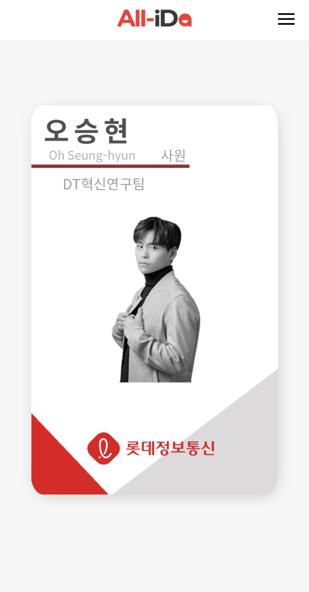
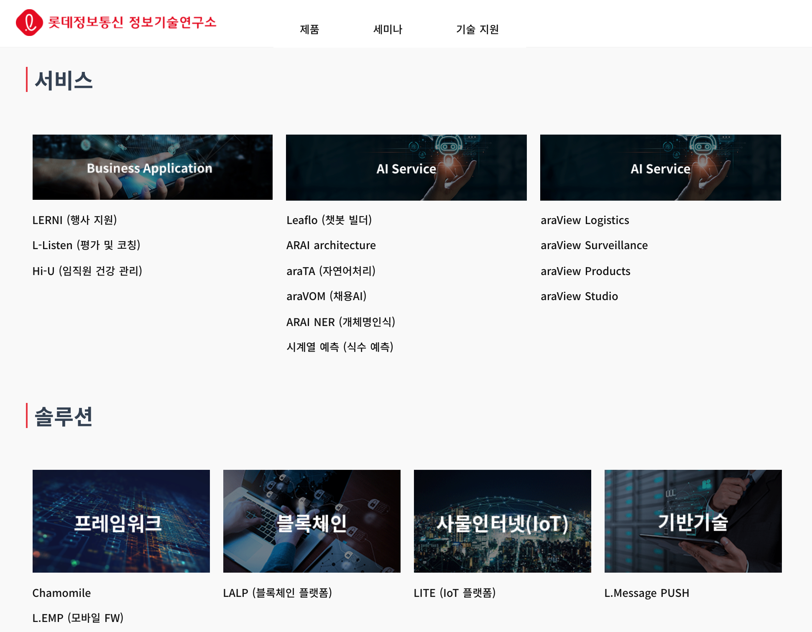

<figure class="float-left" style="width: 200px; padding: 0 0 10px 0 ">
	
	<figcaption>코엑스 전시회 중</figcaption>
  </figure>

**노력하는 개발자   오승현입니다.**

 
 
 
 
 

---

## 💁🏻 Introduction

- 안녕하십니까 3년차 프론트 엔드 개발자 오승현입니다.
- 1년 동안 서버 개발을 했었지만 프론트에 더 흥미가 있어 프론트 개발자로 전향하였습니다.
- 개발을 할 때 성능도 중요하지만 사용자의 UI/UX에 초점에 맞추어 개발을 하려고 노력합니다.
- 새로운 것을 배우는 거에 부담감이 없고 많은 기술을 배우려고 노력합니다.
- DRY(Do not Repeat Yourself) 와 KISS(Keep It Simple Stupid)을 항상 고민합니다.
- 문제가 생길 시 ☕️를 마시며 느긋하게 생각하는걸 좋아합니다.

---

## ⛏️ Skills

### Frontend

- HTML5, CSS3(SCSS), JS(ES6)
- Vue.js (주력)
- Nuxt.js
- Typescript
- Cordova
- React (현재 공부 중)
- graphQl

### Backend

- Java
- Spring Boot, Spring MVC, Spring Batch, Spring Data JPA
- JPA

### Studing...

- 디자인 패턴
- scss

---

## 💻 Projects 
Projects

### DID 모바일 사원증 앱

_2021.03 ~ 2021.05_

- Vue.js 를 사용한 모바일 사원증 프론트엔드 개발
- NFC, BLE, FingerPrint, SecureStorage 등 네이티브 플러그인 사용
- 다날 본인인증 라이브러리 사용
- DID(Decentralized Identity)를 이용한 신원증명 인증서 데이터 관리
- FCM 푸쉬 라이브러리 사용

### 모바일 사원증 관리자 페이지 개발

_2021.02 ~ 2021.03_

- Element UI 프레임 워크를 사용하여 Vue 프론트 개발
- REST API 기반 통신
- JavaScript Canvas 라이브러리인 FabricJs를 사용하여 수정가능 한 사원증 템플릿 개발

### DID 모바일 방문증 앱과 관리자 페이지

_2020.06 ~ 2020.11_

- Vue.js와 화면 프레임워크 onsen ui 사용
- 사내 방문증 시스템 연계
- 네이티브 QR 코드 , NFC, 본인인증 사용

### 사내 솔루션 소개 서비스 개발

_2020.03 ~ 2020.5_

- 사내 솔루션 소개 페이지 화면 개발
- Nuxt 프레임워크를 사용하여 서버사이드렌더링 및 SEO 구성
- TypeScript를 사용한 타입 정의

### 블록체인 솔루션 개발

_2019.12 ~ 2020.3_

- Hyperledger Fabric 오픈소스 사용
- 블록체인 노드들을 묶어주는 채널 생성 및 블록체인 계정 생성 개발
- 블록체인의 체인코드 설치 및 커밋 개발
- 블록체인 모니터링 도구인 Explorer 연동
- 블록체인 성능 측정 도구인 Caliper 사용하여 TPS 측정

 
 

## ⛷ 인상 깊었던 프로젝트

### 모바일 사원증 템플릿

- canvas.js 라이브러리 사용
- 원하는 데이터와 이미지를 통해 사원증 템플릿 생성
   

<figure class="float-left" style="width: 100%;max-width: 32rem; padding: 0 0 10px 0 ">
    
    <figcaption>템플릿 이미지</figcaption>
</figure>

<figure class="float-left" style="display:flex; width: 100%;max-width: 44rem; margin:0px; padding: 0 0 10px 0 ">
    

        
        <figcaption>템플릿 만들기</figcaption>
    

    

        
        <figcaption>모바일 사원증 앱</figcaption>
    

</figure>

---

 

### Nuxt.js를 사용한 사내 솔루션

- 첫 SEO의 경험
- SSR(서버사이드 렌더링)과 (CSR)클라이언트 사이드 렌더링의 결합
- 페이지 내 메타데이터 추가

<figure class="float-left" style="width: 100%;max-width: 32rem; padding: 0 0 10px 0 ">
    
    <figcaption>사내 솔루션 소개 사이트</figcaption>
</figure>
