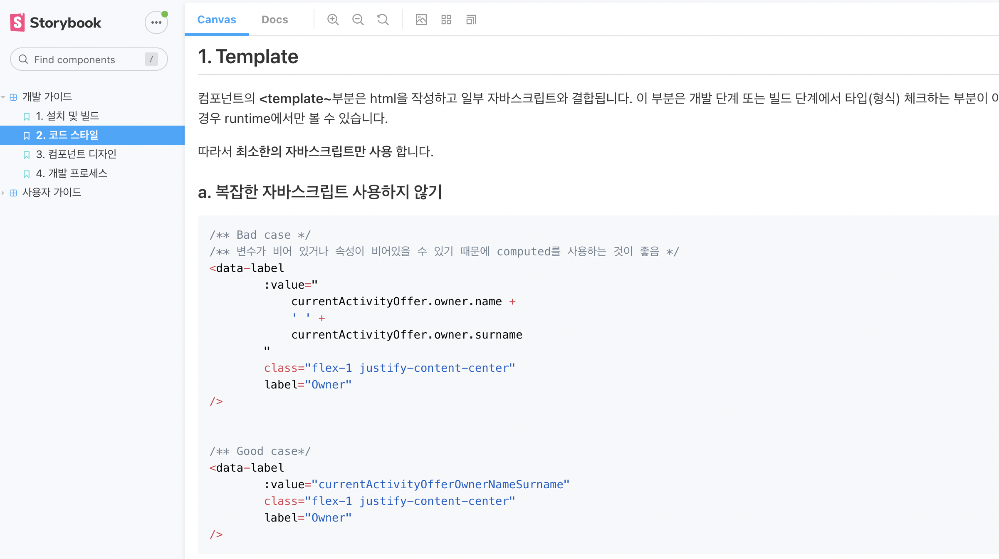

Vue 프로젝트 경험과 프로젝트 하면서 고민했던 내용들입니다. 어떻게하면 공통된 코드를 일관되게 유지하면서 유지보수를 잘 할 수 있는지에 대해 중점적으로 다루었습니다.

 

<figure style="display: flex; ">
  

        
        <figcaption>모바일 사원증 앱</figcaption>
        

  

  
모바일 사원증 프로젝트

DID 기반 모바일 사원증 프로젝트로 본인인증과 인사 정보를 받아 블록체인 자기 신원증명으로 인증서를 만들어주고 이 인증서를 통해 출입증을 발급합니다. 발급받은 출입증에는 출입할 수 있는 고유번호가 있으며 블루투스나 NFC로 출입문 게이트를 인식해 유효하다고 판단하면 게이트를 열어주는 앱입니다.

</figure>

---

## 🔨 아키텍처

### UI

- atomic 컴포넌트 적용
- UI 영역과 비즈니스 영역을 분리

### Service / Vuex-action

- 실제 비즈니스 로직을 service 파일과 vuex의 action 활용
- 기능별 xxxService.js 형태로 관리
- 클린 아키텍처의 Controller/service 개념 통합

### api

- 서버와 통신하는 비동기 코드들
- 기능 xxxApi.js 형태로 관리
- 클린 아키텍처의 Gateway/Repository 개념 통합

### 상태관리

- 각각 기능의 가장 상위(root) 페이지에서 관리
- 전역으로 사용하는 데이터는 Vuex 활용 ex) user, settings

참고)

- [아토믹 컴포넌트 TODO APP 예제](https://velog.io/@thsoon/%EC%93%B8%EB%95%8C%EC%97%86%EC%9D%B4-%EA%B3%A0%ED%80%84%EC%9D%B8-%ED%88%AC%EB%91%90%EB%A6%AC%EC%8A%A4%ED%8A%B8-%EB%A7%8C%EB%93%A4%EA%B8%B0-FE-2.-%EB%B7%B0-%EC%84%A4%EA%B3%84)
- [Atomic Design Methodology](https://atomicdesign.bradfrost.com/chapter-2/)
- [프론트에 적용하는 클린 아키텍처](https://uchanlee.dev/clean-architecture/clean-architecture-for-frontend/)

---

# 💻 Develop

### 타입스크립트 적용

- 에러 사전에 방지 (런타임 -> 컴파일타임)
- 코드의 자동 완성을 통한 개발 생산성 향상
- 각 기능별 entity 정의해서 사용

### 코드 컨벤션 작성

- 가독성과 유지보수를 위한 일관된 코드를 위해 코드 컨벤션 필요
- 컨벤션 정의를 사내 게시판과 StoryBook을 통해 공유
- 하단 참조 사이트를 통해 파트 표준 컨벤션 정의

### 참조

- [NHN Toast JS 컨벤션](https://ui.toast.com/fe-guide/ko_CODING-CONVENTION)
- [NHN Toast JS 안티패턴](https://ui.toast.com/fe-guide/ko_ANTI-PATTERN)
- [Vue 스타일 가이드](https://kr.vuejs.org/v2/style-guide/index.html)
- [TypeScript 스타일 가이드](https://radlohead.gitbook.io/typescript-deep-dive/styleguide)

### 라이브러리

- bootstrap, validate, i18n, mask 등 개발에 필요한 라이브러리 사용
- 다른 라이브러리와 비교할 때 사용성, 인기도, git star 수, 최근 업데이트 날짜, 이슈 사항 등 고려해서 선택

---

## 🌈 기능 개선

### 변경 가능한 템플릿

- 사원증의 템플릿이 고정적이지 않고 관리자가 자유롭게 변경가능 하도록 설계
- fabric.js 라이브러리 활용
- 다른 라이브러리로 pixi.js가 있었고 애니메이션에 좀 더 특화되어 있었음
- 텍스트 위주로 사용과 svg 변환에 용이한 fabric.js 라이브러리 채택

- [fabric.js 라이브러리](http://fabricjs.com/)
